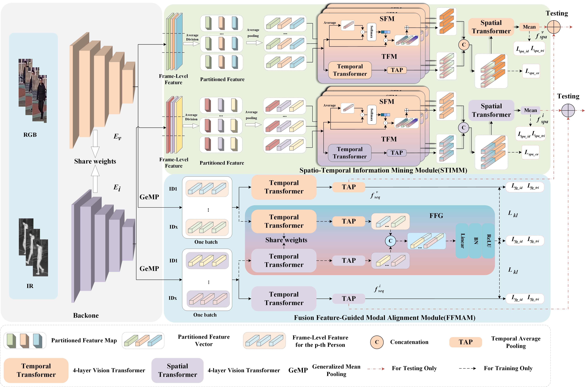

# Spatio-temporal Information Mining and Fusion Feature-Guided Modal Alignment for Video-based Visible-Infrared Person Re-identification
## Pipeline




## Requirements

### Installation

We use /torch >=1.12.0 / 24G  RTX3090 for training and evaluation.
```shell
pip install -r SIMFGL/requirements.txt
```

### Prepare Datasets
1. Download BUPTCampus from [baidu disk](https://pan.baidu.com/s/1GlAlNoSWUuvaGPjOzK4jqQ?pwd=bupt). The file structure should be:
```
path_to_dataset
|—— DATA
|—— data_paths.json
|—— gallery.txt
|—— query.txt
|—— train.txt
|—— train_auxiliary.txt
```
2. Download VCM-HITSZ from [baidu disk](https://github.com/VCM-project233/VCM-HITSZ-data). The file structure should be:
```
path_to_dataset
|—— ID
|—— info
```

## Training and Evaluation


1.Train and test on the VCM-HITSZ dataset by first navigating to the VCM-HITSZ directory and running train.py or test.py.
```shell
python train.py/test.py
```
1.Train and test on the BUPTCampus dataset by first navigating to the BUPTCampus directory and running train.py or test.py.
```shell
python train.py/test.py
```

For direct testing, please download our prepared checkpoints and extracted features from 
[baidu disk](https://pan.baidu.com/s/1-yih9mDnr9HdwY-GUfeD5Q?pwd=a7u4).

## Acknowledgement
A large part of codes are borrowed from 
[MITML](https://github.com/VCMproject233/MITML).
Thanks for their excellent work!

## Contact

If you have any questions, please feel free to contact me. (zuozhigang2024@163.com).
